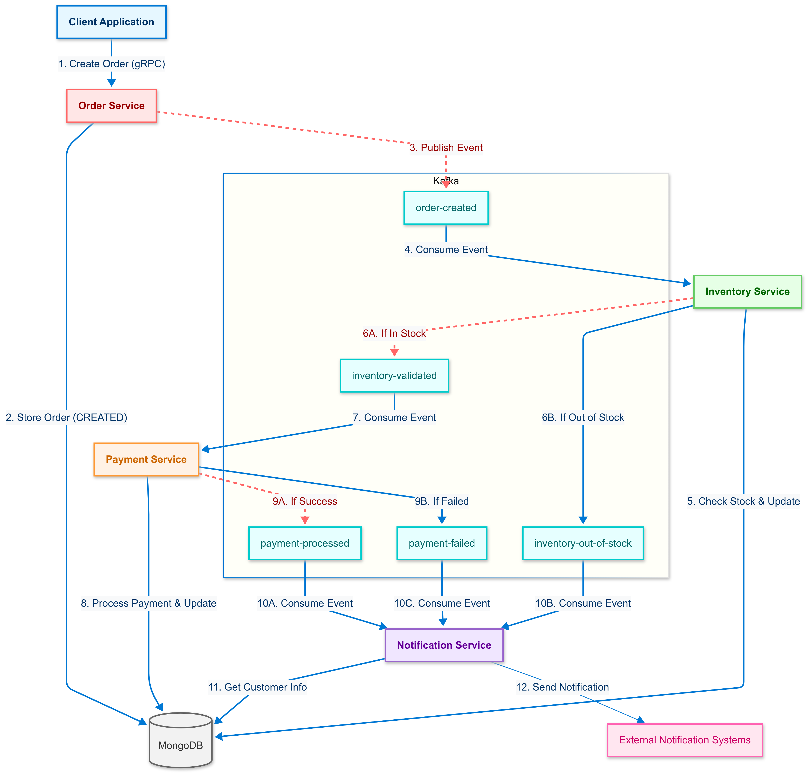

# Order Management System



## Overview

Event-driven microservices application for processing orders with the following components:

- **Order Service**: Receives customer orders via gRPC API
- **Inventory Service**: Validates product availability
- **Payment Service**: Processes payments for validated orders
- **Notification Service**: Sends notifications about order status changes

## Tech Stack

- Go for all microservices
- Apache Kafka for event-driven communication
- MongoDB for data persistence
- gRPC for external API
- Docker and Docker Compose for containerization

## Getting Started

```bash
# Clone the repository
git clone https://github.com/kanishkmehta29/order-management-system.git

# Start all services
docker-compose up -d

# Create an order using gRPC (port 50051)
# View notifications in the logs
docker-compose logs -f notification-service
```

## Architecture Flow

1. Client creates an order via gRPC
2. Services communicate asynchronously via Kafka events
3. Order status updates trigger notifications
4. All data is persisted to MongoDB
